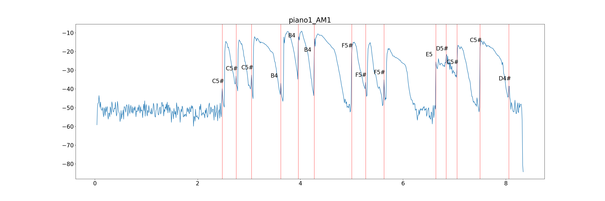

### Music Teacher

#### **Intro**

This app helps ppl improve their music skills in a scientific way. I'm studying Music and Comp Sci, so I developed this app as my 'digital music teacher' to train my music skills such as transposition,  singing in tune, rhythm, chord harmonics and so on. 

This Music_teacher.1.0 supports the transposition feature now. Singing in tune feature is coming soon!

- ##### **Transposition**

This feature checks if you correctly transpose a melody to another key. The mechanism of the feature is following:

1. imports the *original_melody* and  *transposed_melody* audio file 
2. analyzes the audio files and draw analysis pic, stores image in */output_images*
3. locates the notes in the files
4. recognizes the pitch of each note 
5. checks the interval of each note in *original_melody* and *transposed_melody*. If the interval isn't right, help the user correct his/her transposition.

****




- **Singing in Tune**

coming soon (as long as I have enough money to buy a new computer to train model:( )


#### **How to start**

1. clone the repo to local

2. ```python 
   python -m pip pydub, matplotlib, scipy

3. ```pyt
   python Music_teacher.py
   ```

4. select which feature u wanna use

5. enter required info following the prompts


#### **Some problems**

- note recognition part might be incorrect depending the quality of audio 
- cost of pitch recognition part is still high


#### **Skills**

python, pydub, matplotlib, 

#### **Reference**

https://realpython.com/python-scipy-fft/

